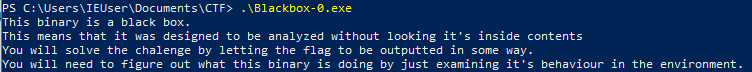
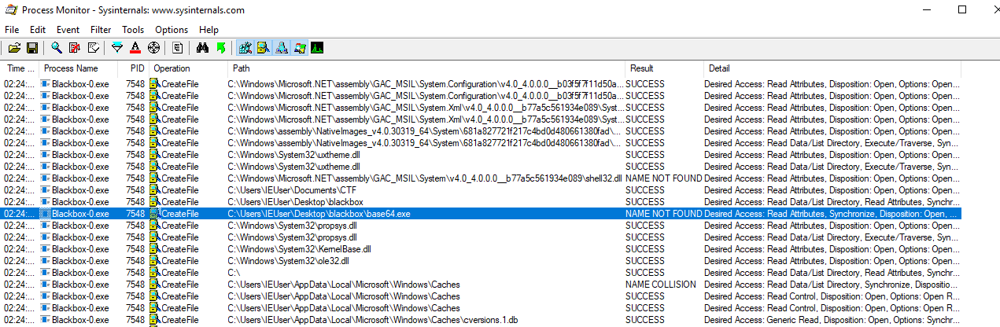
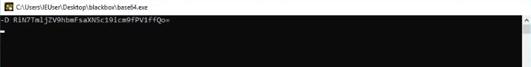

# FireShell CTF 2019

[CTFTime link](https://ctftime.org/event/727) | [Website](https://ctf.fireshellsecurity.team/)

## Challenges solved

### Recon

 - [X] Welcome
 - [X] Where is the IRC?

### Reversing

 - [X] [Blackbox-0](#blackbox-0)
 - [X] Blackbox-1
 
 
### Misc
 
 - [X] babycryptoweb
 
### Crypto

 - [X] Biggars
 
---

## Writeups

Note: this section only list solved challenges except when explicitely mentionned the opposite.

### Blackbox-0

Blackbox-0 is a program written in .NET. When executing this program, it gives us a hint on how to analyse it:

[Process Monitor](https://docs.microsoft.com/en-us/sysinternals/downloads/procmon) (also called  procmon) is a monitoring tool from Windows Sysinternals suite that shows file and registry activity. To reduce the number of events displayed in procmon, the following filters can be applied for the analysis of Blackbox-0.exe:
 
 * Process Name is Blackbox-0.exe
 * Operation is CreateFile 

Running Blackbox-0.exe while monitoring its activity with procmon shows an interesting file the application tried to access called "base64.exe". According to procmon, this file could not be found by Blackbox-0.exe ("NAME NOT FOUND" in the Result column). 

The "base64.exe" application is probably used by Blackbox-0.exe to decode the base64 encoded version of the flag. Searching a Windows version of base64.exe led us to a sample at [this location](https://support.microsoft.com/fr-ch/help/191239/sample-base-64-encoding-and-decoding). However the download link is no longer valid.

Instead of using a working base64.exe, we can use an application that echo anything given to it, i.e. an equivalent of "echo" for Windows. In the [Windows Flare VM](https://github.com/fireeye/flare-vm), a binary called "echo.exe" can be found in "C:\ProgramData\chocolatey\bin" for example.

By (1) putting echo.exe in "C:\Users\\<USERNAME\>\Desktop\blackbox", (2) renaming echo.exe to base64.exe, and (3) running again Blackbox-0.exe, the base64 version of the flag is displayed as shown in the screenshot below. To be noted that the popup disappears very fast. One solution is to record a video of the screen while executing Blackbox-0.exe and look at the recording frame by frame.

